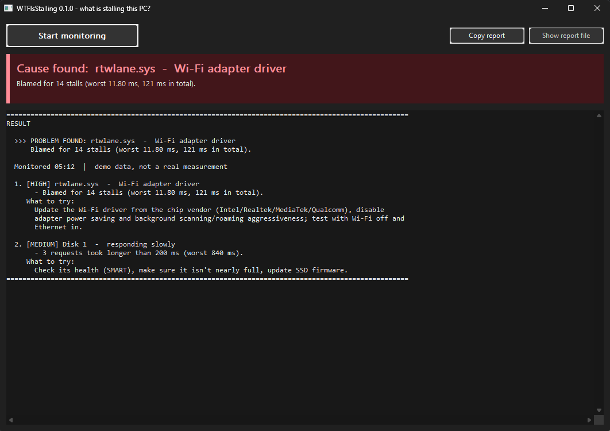
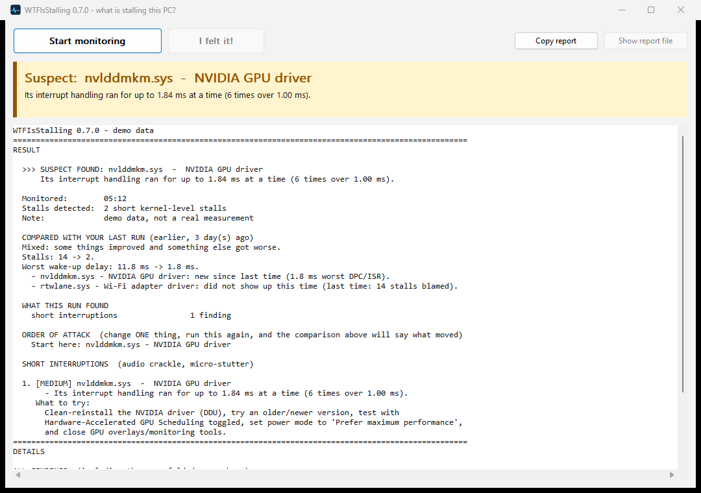
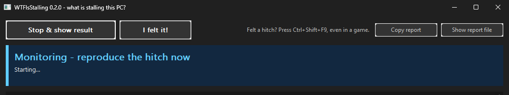

# WTFIsStalling

[](https://github.com/Tyberious/WTFIsStalling/actions/workflows/ci.yml)
[](https://github.com/Tyberious/WTFIsStalling/releases/latest)
[](https://github.com/Tyberious/WTFIsStalling/releases)
[](LICENSE)


[](https://github.com/Tyberious/WTFIsStalling/issues)
[](CONTRIBUTING.md)
[](https://github.com/Tyberious/WTFIsStalling/stargazers)

**Finds the driver, program or hardware behind hitches, micro-stalls and audio crackle on Windows.**

Someone tells you "my PC stutters every few seconds" and nothing in Task Manager explains it.
WTFIsStalling watches the Windows kernel while the problem happens and then tells you, in plain
language, what was responsible and what to try.

It is a single small `.exe`. No installer, no driver, no dependencies. It only observes; it changes
nothing on the system.

## Use it

1. Download `WTFIsStalling.exe` from [Releases](https://github.com/Tyberious/WTFIsStalling/releases) and run it.
   Say **Yes** to the administrator prompt (tracing the kernel requires it).
2. Click **Start monitoring**.
3. Use the PC until the hitch happens, ideally a few times. Run the game or app that has the problem.
   **When you feel a hitch, press Ctrl+Shift+F9** (works inside games) or click **I felt it!** The report
   then zooms in on the seconds before each press, with no thresholds.
4. Click **Stop**. Read the summary, or click **Copy report** and paste it to whoever is helping you.

> **"Windows protected your PC"?** That is SmartScreen reacting to a new, unsigned program that few
> people have downloaded yet, not a virus detection. Click **More info**, then **Run anyway**. If you
> would rather verify first, compare the file against `SHA256SUMS.txt` from the same release
> (`Get-FileHash WTFIsStalling.exe` in PowerShell), or build it yourself from this source.
>
> **Antivirus blocked the download?** Detections whose name ends in `!ml` (for example
> `Trojan:Win32/Wacatac.B!ml`) are a machine-learning guess, not a match against known malware. New,
> unsigned tools that ask for administrator rights and read low-level system data get them often. The
> source is all here, releases are built by GitHub Actions from the tagged commit, and the checksums
> are published with each release. Please [open an issue](https://github.com/Tyberious/WTFIsStalling/issues)
> with the detection name so it can be reported to the vendor as a false positive.

The colored bar gives the verdict; the report underneath starts with the ranked findings and what to
try for each, followed by the supporting numbers and the event log. A copy is saved next to the exe as
`WTFIsStalling-<date>.txt`. The window follows the system light / dark theme.

**Did it help?** Try what the report suggests, then run the tool again. The second report says what
changed, in the RESULT block right under the overview:

```
  COMPARED WITH YOUR LAST RUN (2026-09-14 19:02, 6 day(s) ago)
  Better: what was found last time did not show up this time.
  Stalls: 14 -> 0.
  Worst wake-up delay: 11.8 ms -> 0.30 ms.
    - rtwlane.sys - Wi-Fi adapter driver: did not show up this time (last time: 14 stalls blamed).
```

There is nothing to switch on and nothing to remember: every run saves its numbers next to its report
as `WTFIsStalling-<date>.wtfis`, and the next run on the same PC picks the most recent one (up to 30
days old) by itself.

| | |
| --- | --- |
|  |  |



*(Screenshots show built-in demo data.)*

## What it can pin down

| Cause | How it shows up |
| --- | --- |
| **The whole PC stopping** (cursor and sound gone for a moment) | A kernel-level stall that holds every logical CPU at the same instant for 100 ms or more is its own kind of incident, counted once even though both probes see it. Nothing that happened to be on the CPUs is blamed for it: they were stopped too. Instead the report says how often it happens and how long it lasts, whether the processors were idle or busy, **which device interrupts stopped and which kept arriving** during it, whether the timer interrupts that wake threads stopped, and what coincided with it (a slow request to a drive, a drive that had been asleep, a page fault) — in correlation language, with the number that coincided with *nothing* said just as plainly |
| **Whether a stalled thread was ever woken at all** | Every context switch and thread wake-up is traced, so for each stall the report reconstructs what the scheduler did to its own measuring threads: they were never made runnable until it was over (nothing woke them — the timer, the clock, firmware or power management, below Windows' scheduling and below every driver), or they were made runnable **on time** and then not given a processor (the scheduler or the platform — and when the processor had nothing else to do at all, plainly so), or they ran and had to wait for something again. The whole-PC freeze finding counts the freezes each way: "in 9 of them the measuring threads were never made runnable, in 3 they were made runnable on time and left waiting" |
| **A program kept waiting** at a moment you flagged | At each moment you flag, and at each CPU-starvation stall, the threads that spent longest ready-but-not-running and longest blocked, per program: how long, what held the processor instead, and which program's thread woke a blocked one ("blocked for 45 ms, woken by a thread in audiodg.exe"). Only waits long enough to feel (25 ms ready, 50 ms blocked), and never a program that chose to sleep. It says how long and by what, never **which** lock or **why**, and it is capped at medium severity for exactly that reason |
| A misbehaving **driver** (GPU, network, Wi-Fi, USB, audio, storage, RGB/monitoring tools...) | Long DPC/ISR routines, attributed to the exact `.sys` file and named after the device it drives ("NVIDIA GeForce RTX 5090", "Realtek PCIe 5GbE Family Controller"), with the driver's version, date and age, and advice for the usual suspects |
| **Firmware / BIOS / SMI**, hypervisor, or a driver running with interrupts off | The CPU "goes dark": a stall with no OS-visible activity and missing profiler interrupts |
| A **program** starving the CPU | A normal-priority thread can't get a core; the report names who was on the CPUs |
| **CPU throttling** (heat or power limits) | Busy cores running well under their rated speed, or Windows reporting a performance cap, and whether stalls coincide; backed up by the "firmware limited the processor's speed" event when Windows logged one |
| **Stalls concentrated on the efficiency cores** of a hybrid processor (P-cores / E-cores) | Each stall says which kind of core it hit. When they pile up on the E-cores, a low-severity finding says so and lists what Windows documents as sending a program there (Task Manager's "Efficiency mode"; on battery, background and out-of-view work) |
| Something **polling on a timer** (RGB / monitoring / vendor utilities) | Stalls or long interrupt runs that repeat at a steady interval: "repeats about every 10.0 s". Also *below* the stall threshold: every driver's interrupt activity is recorded in quarter-second buckets across the whole run, so a third-party driver that wakes every few seconds for a moment — too briefly to stall anything — is still reported as keeping time |
| **Utilities that talk to the motherboard hardware directly** (RGB, fan, monitoring, overclocking) | The kernel drivers they install are matched against a table where every row carries a published source — Microsoft's vulnerable-driver blocklist, a CVE record, a vendor advisory or an upstream project's own source tree — and the report names the product ("SignalRGB (SignalIo.sys)"), not just the file. Low severity by itself, because several of these at once is the normal case; attached as **context** to a whole-PC freeze, a "CPU went dark" or a periodic finding, where it makes "fully exit these one at a time" name the products actually installed. The mechanism is explained from primary sources only: an I/O write can be turned into a firmware interrupt that stops **every** processor core, which Microsoft describes as "latency spikes of 100 microseconds or more" and says Windows cannot intervene in. The report says plainly that it cannot prove that happened — reading the processor's own counter needs a kernel driver, and this tool ships none |
| **Which program a driver was working for** | A driver runs because something asked it to, and the CPU samples inside a stall say who. When one program held the processor through most of a driver's stalls, the finding says so ("its stalls happened while iCUE.exe was on the processor, in 9 of the 11 of them") — worded so that Windows' own components are never described as something to close |
| **Network filter drivers from other vendors** (VPNs, "network optimizers", security products) | Windows runs a filter's code inside its own networking files, so a stall in `NETIO.SYS` or `ndis.sys` can be another vendor's doing. The installed NDIS lightweight filters are read from the registry and the ones written by someone other than Microsoft are named on such a finding — and when they are all Microsoft's, that rules a whole class of software out |
| **Devices on an old-style shared interrupt** | Per present PCI device: the interrupt mode actually in use (from the allocated resources) against what the hardware advertises (from the device's PCI properties). A device on a shared line whose own hardware offers the message-signaled kind is reported at low severity, with what Windows records about it — and the advice is deliberately careful: a current driver from the device maker and a BIOS update, never a recipe for editing the registry |
| **Paging** (not enough RAM, or a process being swapped in) | Hard page faults per process with how long each was frozen, and which file the memory was read back from when one file dominates |
| A **slow or dying disk** | Per-disk request latency, slow requests and who issued them; the disk is named by drive letter, model, connection, size, firmware and how full it is, and the report says **why** it was slow: busy (and which program was moving the data), asleep and waking up, forced flushes, or idle-but-slow (the drive, cable or firmware). The files that waited longest are named (`pagefile.sys`, `$Mft`, a game's `.pak`...) in plain words, with the program that issued the requests (by image name, several processes of one program counted as copies: "powershell.exe 2 copies"), and change the advice where they change the answer: a paging file means the PC ran out of memory, game data on a hard drive means moving the game. Each slow request also says **what it was** (paging, file-system bookkeeping or a file's contents), **which programs were stuck behind it** and any program waiting on a lock held by one of them, and on a hard drive whether two programs were making its head jump back and forth. For drives run by Windows' storage port driver (NVMe, SATA, UAS USB) it also says **where the time went**: how much was spent inside the drive (the drive, its cable or firmware) and how much waiting in Windows before reaching it (too much asked of the drive at once), with any retries; a drive that driver does not see (older USB "BOT" drives) is reported as not measured, never as zero |
| **Antivirus, backup, cloud-sync or encryption software in the path of slow disk waits** | Each disk request and each slow hard page fault carries a *module-level* call stack: the drivers that were on it, never function names (those need Microsoft's symbol files, i.e. network access, which this tool does not have). So a slow request says which drivers it went through ("via FLTMGR.SYS -> Ntfs.sys -> WdFilter.sys"), with `--deep` a program stuck behind it also says which driver it was blocked in, and the disk finding totals the file-system filters in the path ("WdFilter.sys (Microsoft Defender Antivirus, antivirus scanning) in 80%"). Filters are recognized from the load order group Windows registers them in, and named from Microsoft's documentation or the file's own version resource. Being in the path is never called the cause — every file access on Windows passes through several filters — and Microsoft Defender is never something to turn off: when it is in the path of most slow requests, the report points to Microsoft's documented folder exclusions, with Microsoft's warning |
| **A drive being reset or retried while you watch** | The storage port driver's own events, live: requests it had to send again and resets of a drive or its controller, with the time and the disk. A reset during the run is rated high, the same as Windows' event 129, and one Windows also logged is reported once |
| **A drive that is failing, overheating or on a bad cable** | Each drive's own health data, read when monitoring starts and ends: NVMe critical warnings, media errors, wear, temperature and thermal throttling; SATA SMART bad sectors and CRC (cable) errors. Counters that moved *while monitoring* are flagged as the cause, lifetime totals only as background |
| **Drive errors Windows logged** | System event log, last 7 days: controller resets (129), retried I/O (153), bad blocks (7), paging errors (51), surprise disconnects (157) |
| **Graphics driver hangs** | "Display driver stopped responding and was reset" (event 4101) from the System event log, last 7 days |
| **The graphics card running out of video memory, or simply being the limit** | Once a second, per GPU: load, video memory in use, and the program responsible. Full video memory is reported with the program holding it and how much was pushed out to system RAM. At the moments you flag, the report says whether the GPU was working flat out (lower GPU settings) or had spare capacity (the hitch is on the CPU side or in the game) |
| **The picture actually stopping** | A second, small ETW session on the graphics kernel records every display refresh and every frame handed to the card. At a moment you flag, the report can say "no new picture reached the screen for 240 ms" and which program's frames stopped — the part of a hitch a processor-side trace cannot see at all. The same session catches the card telling Windows to free video memory, which is the card's own answer to "is it full?" |
| **Failing or unstable hardware** | WHEA errors from the System event log, last 7 days: corrected memory errors (unstable XMP/EXPO, bad DIMM), corrected processor errors (undervolt, PBO, overclock), PCI Express link errors with the device named (riser cables, GPU, NVMe), and fatal hardware errors that crashed the PC. A stall within 2 seconds of such an error is tied to it |
| **Crashes and sudden power loss** | Unexpected shutdowns from the System event log, last 7 days: blue screens with their stop code, and silent restarts or power loss (power supply, heat, unstable overclock) |

What it cannot see yet: what happens inside an application or inside a frame (shader compilation,
frame pacing). It can rule the rest out, though: if you flag a hitch and no CPU core was
interrupted for even a millisecond around it, the report says so, and that's where to look next.

## Example report (illustrative)

```
====================================================================================================
RESULT

  >>> PROBLEM FOUND: The whole PC stopped responding, 12 times
      12 freezes in 59 minutes (12 per hour), typically 950 ms and at worst 1000 ms. All 8
      processors stopped at the same instant each time, so no program that happened to be running
      can be the cause.

  Monitored:        59:21
  Stalls detected:  12 whole-PC freezes, 71 short kernel-level, 35 CPU-starvation
  Worst wake-up:    1000 ms real-time thread, 1005 ms normal thread

  WHAT THIS RUN FOUND
    the whole PC stops                 1 finding
    short interruptions                4 findings
    one program waits                  5 findings
    worth knowing, not a hitch yet     3 findings

  ORDER OF ATTACK  (change ONE thing, run this again, and the comparison above will say what moved)
    Start here: The whole PC stopped responding, 12 times
    Then: Disk 6 (I:), Seagate FireCuda Forge - responding slowly
    Later: the 3 warnings under 'worth knowing, not a hitch yet'. They are not causing hitches yet.

  THE WHOLE PC STOPS

  1. [HIGH] The whole PC stopped responding, 12 times
       - 12 freezes in 59 minutes, about 12 per hour. Typically 950 ms, at worst 1000 ms. ...
       - The processors were not busy working: they were 2-86% idle during the freezes ...
       - Device interrupts did not all stop together: Wdf01000.sys stopped completely in 8 of 12.
         Meanwhile dxgkrnl.sys kept arriving in 8 of 12 ...
       - 8 of the 12 freezes coincided with a slow request to disk 6 (I:), a drive that had been
         asleep, taking up to 2173 ms. 'Coincided' is all this says ...
       - 4 of the 12 freezes coincided with nothing at all that this tool can see.
       - Context, not blame: the programs the processors were interrupted in were SignalRgb.exe,
         explorer.exe, NordVPN.exe ... They were frozen along with everything else.
       - What is NOT explained: no driver's interrupt handling was long enough to do this, no
         single processor was held, and the cause of the freezes is not visible in this trace.
     What to try:
       Test one layer at a time and run this tool again after each change ...

  SHORT INTERRUPTIONS  (audio crackle, micro-stutter)

  2. [MEDIUM] NETIO.SYS  -  Windows network stack
       - Blamed for 55 stalls (worst 13.52 ms, 415 ms in total), about 56 per hour.
       - The stalls keep time. Repeats about every 60.0 s (41 of 44 intervals) ...
     What to try: ...

     + 3 more in this group, with the full tables under DETAILS below: ...
====================================================================================================
DETAILS
  (every finding including the folded ones, who caused the stalls, per-driver DPC/ISR table, hard
   page faults per process, disk latency, drive health, what the Windows event log held)

EVENT LOG (chronological)
[10:50:01.300] FREEZE #50  the whole PC stopped  990 ms  (8 of 8 CPUs held at once)
    The normal-priority probe in this tool's other process was late by 991 ms at the same instant: the same
    event seen twice, counted once.
    VERDICT: the whole PC stopped. 8 of this PC's 8 processors were held for 990 ms at the same instant,
             so no program or driver that the CPU samples landed in can be the cause: they were stopped too.
             Ordinary DPCs kept executing throughout, so no CPU was held at raised IRQL ...
    Interrupt sources that STOPPED during the freeze: Wdf01000.sys (0% of its usual rate)
    Interrupt sources that kept going:                dxgkrnl.sys (78% of its usual rate)
    ...
```

Findings come from stalls (who was blamed), drivers whose DPC/ISR routines run too long even without a
full stall, programs frozen by paging, disks answering slowly, what each drive reports about its own
health, and hardware, storage and graphics-driver errors in the Windows event log. **HIGH** means it
repeatedly or badly stalled the machine, or went wrong while you were monitoring; **MEDIUM** is a
suspect that can cause crackle and micro-stutter; **LOW** is a lead worth knowing about.

**Several problems at once.** Real PCs rarely have one. Findings are grouped by the symptom they
produce — the whole PC stops; short interruptions (crackle, micro-stutter); one program waits (disk,
memory, graphics); worth knowing but not a hitch yet — and the first screen is a plan: how many of
each, then an order of attack. Change **one** thing, run again, and the comparison at the top of the
next report says which layer moved. The five worst findings are shown in full (plus the worst of any
group that would otherwise be empty); the rest are folded into one line per group, and every finding
is listed under DETAILS.

**Severity is relative to the run, not to how long you watched.** A count-based rule turns an
hour-long run into a wall of HIGH: one 31 ms stall was HIGH because 31 is over 15. So severity is
judged on rates and shares — stalls per hour and the share of the run they cover, over-long DPC runs
per hour, paging time as a percentage of the run, slow disk requests per hour — with one absolute
exception, because a single interruption long enough to see is serious however rarely it happens.
How many processors a kernel-level stall held counts too: a stall on 1 of 32 leaves the other 31
working, so for the "long enough to see" and "share of the run" rules each stall counts in
proportion to the processors it held, with a quarter of them or more counting in full (a rule of
thumb; on a 4-thread laptop one core already is a quarter). The audio-crackle rule (a 5 ms stall
every ten seconds) is not weighted, because audio breaks up when the one core its work is on is
held, and a 50 ms hold on any core is still at least a suspect. Whole-PC freezes are always HIGH.

## How it works

Two independent sources, correlated on one clock (QPC):

* **Kernel ETW trace.** A private real-time system-logger session records every DPC and ISR (with the
  driver routine address and duration), hard page faults, disk I/O latency, file names, thread creation
  (for thread → process mapping), 1 kHz CPU profile samples and — the expensive one — every context
  switch and every thread wake-up. The start of every disk request and every hard page fault also
  carries a call stack (see below). Routine addresses are resolved to the loaded
  driver; a built-in knowledge base plus each file's version resource explains what that driver is. Each
  routine's activity is also recorded as one bit per quarter-second of the run — a few hundred kilobytes
  in total, and one hash lookup per event — so that a driver waking on a steady timer can be seen even
  when nothing it does is long enough to stall anything.
* **Graphics-kernel ETW trace.** A second real-time session on the same clock, enabled on
  Microsoft-Windows-DxgKrnl with one keyword (`Present`) and an event-id filter listing six events:
  the vertical-blank and hardware-flip-queue DPCs (when the screen was actually refreshed), the
  presents each program submitted (when it handed over a new frame), and the residency operations that
  bring textures back into video memory (which carry how much Windows wants freed when the card is over
  budget). Field offsets come from `TdhGetEventInformation`, worked out once per event id and version
  and then read by offset, so there is no per-event decoding cost; a version whose layout cannot be
  worked out is skipped rather than guessed at. It is a few hundred small events a second, it is **off
  in light mode**, `wtfis-cli --no-gpu-trace` turns it off anywhere, and the cost block reports how
  many arrived. If the session cannot start — another profiler holding it, an older Windows — the run
  carries on and DETAILS says in one line that there is no frame-timing evidence.
* **Storage-driver ETW trace.** A third real-time session on the same clock, enabled on
  Microsoft-Windows-StorPort with an event-id filter listing five events: 201, one per disk request,
  which says how long the layers below the storage port driver (miniport driver, controller, drive)
  took; 209, a request being retried; and 1, 2 and 4, a drive, a target or a whole port being reset.
  Each slow DiskIo request is matched to its storage-driver record by the request's I/O packet pointer
  (falling back to same drive, same size, completed within a millisecond, and only when exactly one
  record fits); a request split into several pieces counts the time any piece was inside the drive, so
  pieces in flight together are not counted twice. The rest of the DiskIo time is time spent in Windows
  before the request reached the drive. Which disk a record belongs to comes from
  `IOCTL_SCSI_GET_ADDRESS` on the same zero-access handle the tool uses for every other disk query. It
  stays **on in light mode**: measured at about 1,750 events a second under heavy disk load (against
  roughly 370,000 for the kernel trace), it is one small event per disk request. The retry keywords it
  needs also make the driver build its per-request command trace (about 3,500 events a second in all);
  the id filter keeps those out of the session, but Microsoft documents that such a filter reduces what
  is delivered, not what is generated. `wtfis-cli --no-storage-trace` turns it off, the cost block
  reports how many events arrived, and a session that cannot start never stops the run.
* **The machine itself, read once at the end.** Loaded kernel modules (for the hardware-access driver
  table), the installed NDIS network filters and their binaries (registry only), and every present PCI
  device's allocated interrupt resources and PCI device properties (cfgmgr32). All read-only, all
  cheap, and none of it needs anything the tool is not already allowed to do.
* **Latency probes.** A helper process in the REALTIME priority class runs one thread per CPU at
  priority 31, pinned, waking every millisecond (every 2 ms in light mode) and measuring how late each
  wake-up was. Each probe thread reports its own thread id to the parent, which is what lets the
  context-switch trace say whether a late wake-up was a wake-up that never came or a processor that was
  never handed over. Nothing but
  DPCs, ISRs, code at raised IRQL, firmware (SMI) or a hypervisor can delay those threads, so a late
  wake-up *is* a kernel-level stall. A second, normal-priority probe detects plain CPU starvation.
  Every logical CPU is covered, including machines past 64 of them, where Windows splits the CPUs into
  *processor groups*: each probe is pinned by (group, index) and reports the system-wide CPU number the
  kernel trace uses, so the two always line up.

**What the measuring costs, and light mode.** Every report ends with what the tool itself used: the CPU
time of both processes (the monitor and the probes), as a share of one core and of the whole processor,
plus how many kernel events per second were processed and how many Windows could not deliver. If that
cost is big enough to be part of what was measured — over 5% of the whole processor, either process
holding half a core, or more than 1% of the events lost — a low-severity finding says so in plain words.
On a PC with four logical CPUs or fewer, or one running on battery, the tool switches to **light mode**
by itself: the probes check every 2 ms instead of 1 ms, which roughly halves what the probes cost. The
report says light mode is on and
why, right at the top, because results are then slightly coarser: a stall shorter than about 2 ms between
wake-ups can be missed, and a measured stall can fall short of the real one by up to 2 ms. The decision is
made once, before the run starts, so one report is never half of each. CPU sampling is left alone on
purpose: its interval is a system-wide Windows setting, and this tool changes nothing that could outlive
a run. `wtfis-cli --light` turns it on by hand and `--no-light` keeps full measuring on a small or unplugged PC.

**Context switches are the expensive part.** They are the highest-volume class the kernel logger has —
tens of thousands of events a second on a busy PC — so they go into their own short ring buffer (six
seconds of history, hard-capped at 14 MB whatever the machine does), they are **off in light mode**, and
`wtfis-cli --no-switches` turns them off anywhere. The cost block reports how many of them arrived and at
what rate, so the price is visible next to what it bought. If Windows could not deliver every event,
nothing in the report rests on them at all: one missing wake-up record would turn "woken on time" into
"never woken", so the scheduler findings are left out and the report says so.

When a probe reports a stall, the analyzer waits for the trace to catch up, looks at exactly what ran
on that CPU during that window and issues a verdict:

0. Every (or nearly every) logical CPU was held at the same instant, for at least 100 ms → **the
   whole PC stopped**. The verdict names nobody: everything the CPU samples landed in was stopped
   along with the rest. See below.
1. A driver's own DPC/ISR time covers at least 35% of the stall **on at least half of the stalled
   CPUs** → blame the driver that owns the routine. Coverage is worked out per processor, so a
   driver saturating one core is not diluted to 1/N across a multi-core stall.
2. Almost no profiler interrupts arrived, no DPC/ISR explains it **and ordinary DPCs stopped too**
   → the CPU was taken away from Windows entirely: SMI/firmware, hypervisor, or interrupts disabled.
3. Otherwise → whichever kernel module or process the CPU samples show, but only when the DPC
   records agree that the CPU really was held (see below), and never on a handful of samples.
4. If ordinary DPCs kept executing right through the stall → nothing was holding the CPU at all and
   nothing is blamed: the measuring thread was not woken. The context-switch trace then says which
   kind of "not woken" it was — **nothing made it runnable** (the timer that wakes sleeping threads
   did not fire: the clock, firmware or power management) or **it was made runnable on time and got
   no processor** (the scheduler or the platform, and if the processor was idle throughout, plainly
   so) — and the two are separate findings, because they lead to different places.

**Checking before claiming.** A DPC runs at DISPATCH_LEVEL and cannot preempt code already at
DISPATCH_LEVEL or above on the same processor, so ordinary DPCs executing *right through* a stall
are proof that the processor was not held at raised IRQL. The stall is cut into ten slices and the
claim is only allowed when DPCs are missing from most of them; a queue draining in the last
millisecond does not count. The same check gates "the CPU went dark", which used to be printed for
windows that also contained hundreds of DPC and ISR executions. Percentages of CPU samples are
never quoted on fewer than four samples, and the report says how many samples a share rests on
whenever there are fewer than ten.

**Whole-PC freezes.** "Nearly every CPU" means all of them up to four logical CPUs and three
quarters (never fewer than four) above that, so the rule works both on a 4-thread laptop and on a
64-thread workstation where one parked CPU must not hide a machine-wide freeze. 100 ms is the
classic limit above which an interruption stops feeling instantaneous. One freeze is reported by
the real-time probes *and*, a few milliseconds later and through a different path, by the
normal-priority probe in the other process; the two are matched on both edges and merged into one
incident, so the counts at the top of the report are honest ("12 whole-PC freezes, 71 short
kernel-level stalls, 35 CPU-starvation stalls", not 83 and 47 with the freezes counted twice). For
each freeze, every interrupt source that was firing *steadily* in the seconds before it is compared
with its rate inside it, which is the closest a CPU-side trace gets to watching a bus or a
controller stall. A slow disk request that only began after the machine had already stopped is
marked as a victim of the freeze and is not counted against its drive as well; one that was already
outstanding well before the freeze began is reported as having coincided with it, and nothing more
than that — both in the freeze finding and, since the drive is where a reader will look, on that
drive's own finding ("The whole PC froze 8 times while a slow request to this drive was
outstanding ... 'Coincided' is all this says"). A drive whose slow request only began once the PC
had stopped is never blamed for it: the drive finding says those were slowed down by the freeze.

**Kernel-level stalls get the same checks.** A stall on some of the processors is checked the way a
freeze is: which steady interrupt sources kept arriving and which went silent, whether the timer
DPCs (how the clock wakes sleeping threads) kept their usual rate, and whether a slow disk request
or the measuring thread's own hard page fault covered it. These are facts in the event log. The
verdict changes in two cases only: the measuring thread was itself waiting for its own memory to be
read back from disk (then nothing held the processor, and the stall is put down to paging), or no
processor was held AND the timer DPCs stopped across the PC (which points at timer delivery rather
than scheduling). A slow request that began inside a stall that did not stop every processor is
reported as a coincidence and still counted against its drive.

**One busy core.** For a CPU-starvation stall the idle share is worked out per processor, and time the
profiler attributed to the idle thread while a DPC or ISR was running on it counts as busy, not idle.
When one or a few cores (at most a quarter of those with enough samples) were at least 90% busy while
the rest were at least half idle, the event log says "one core was busy while the others idled",
with what held it (the program in most of its samples, or the driver whose interrupt handling they
landed in), and the finding counts how often that was so. It does not claim the waiting thread was
restricted to that core: nothing in the trace shows a thread's affinity.

**Per-incident context.** A thread priority is printed with the documented band it falls in: 16-31 is
the real-time range, 1-15 the ordinary one (Microsoft's "Scheduling Priorities" table). The band,
not the program's priority class, because Windows' own multimedia scheduler lifts ordinary programs'
audio and game threads into 16-26. Each incident also says, in one short "Context:" line and only when
it was so, that the processor was being throttled within a second and a half of it, or that memory
was at least 85% in use when it was examined.

**Flagged moments.** Wake-up delays from 1 ms up are kept for 30 seconds even though they are far below
the stall threshold. When you press "I felt it", the worst one in the 3 seconds before the press goes
through the same verdict logic as a full stall; if there is none, the CPU side is cleared for that hitch.

**P-cores and E-cores.** On hybrid processors (Intel 12th gen and later) Windows reports an efficiency
class per logical CPU. Stalls are then labeled with the kind of core they hit ("on CPU 17 (E-core)"), and
when they pile up on the efficiency cores the report says so. It claims no more than that: the probes
show which core was held up, not which program was waiting on it. On an ordinary
processor, where every core is the same, nothing about core types is printed.

**CPU clock.** Once a second the "Processor Information" counters are read per core. Only cores that are
busy are judged: an idle core clocking down is normal, a busy core at half speed is throttling.

**Why a disk was slow.** A completed disk request carries its duration, so its start is known too.
What else that disk finished while a slow request was outstanding tells a busy disk (the programs
moving the data are named) from one that had nothing else to do and was slow anyway, which points at
the drive, its cable or its firmware. A slow first request after seconds of silence is a drive waking
from sleep.

**What a slow request was, and who was stuck behind it.** Each disk request also carries its flags and
where on the disk it went. The flags say whether it was *paging* (Windows moving memory between RAM and
the drive: a program's memory to or from the paging file, a program's code being loaded, or some other
file's pages) or an ordinary read or write of a file's contents; the file name says when it was the
file system's own bookkeeping (`$Mft`, `$LogFile`...). With the thread-switch trace on, the threads that
went to sleep on a disk-type wait while the request was outstanding and were woken as it completed
(within a millisecond) are the ones stuck behind it, named by program; a thread woken as another
request finished just as close is left out rather than guessed at. One level of lock chain is followed:
a thread waiting on a lock that one of those threads woke as soon as it got going again ("explorer.exe
waited 1.2 s on a lock held by System, which was waiting on disk 1"). Which lock is never claimed. On
hard drives only, the positions of the requests the drive finished meanwhile show several programs
working far-apart places at once, interleaved, so the head kept jumping between them. When the switch
history does not reach back to a request, nothing is said about who waited for it.

**Which drivers were in the path.** The same kernel session asks Windows to attach a call stack to the
start of every disk request and to every hard page fault (`TraceSetInformation` with
`TraceStackTracingInfo`, a setting of this session only, gone when it stops; nothing system-wide is
changed, which is also why some kernel stacks cannot be walked and are reported as missing). Each
stack is reduced to the drivers on it, in call order, with the Windows kernel itself and repeats
left out; user-mode frames become just the program's name, so no DLL path or anything from your
folders reaches the report. A request's issuing stack is kept only if the request turns out slow,
and a fault's only if it waited 10 ms or more, so memory stays small. A slow request's "Request:"
line gains "via ..." (Windows' own storage drivers below the file system are the first thing left
out when the line is full), a program stuck behind it gains "in <driver>", and DETAILS gets a short
"where the waiting happened" block. The cost block reports how many stacks arrived and at what
rate; light mode leaves them off.

**Drive health and the Windows event log.** Each drive's temperature and health data (NVMe health log,
SATA SMART) is read when monitoring starts and again when it stops, so that counters which moved
during the run (thermal throttling, cable CRC errors) stand apart from lifetime totals. The System
event log is read for the last 7 days: storage resets and retries, WHEA hardware errors (PCI Express
errors are mapped to the device in that slot) and graphics driver resets. Drive serial numbers are
never read, so a report is safe to post.

The event log stays readable when one thing keeps going wrong (a long download to a hard drive can be
slow hundreds of times a minute): the first few events from one disk, driver or program are shown in
full, then they are folded into a roll-up line every 30 seconds, and only an event far worse than any
already shown gets a line of its own. The summary still counts every one of them.

Individually slow events (DPC ≥ 1 ms, hard fault ≥ 50 ms, disk request ≥ 200 ms) are logged even when no
probe stalls.

**Before and after.** Every run writes a small text file of its numbers beside the report
(`WTFIsStalling-<date>.wtfis`): run length, stall counts, worst wake-up delays, the verdict, and for
each finding its subject, severity and the one or two numbers that measure it (stalls blamed, worst
DPC/ISR time, slow requests, seconds throttled...). Nothing else: no prose, no event log, and nothing
that identifies the PC or the person. The file carries a machine id that is only a hash of the
processor model, the board model and the amount of memory — the same three things the report header
prints — so runs from another PC in the same folder are never mixed in; no serial number, user name or
computer name goes into it. If the folder cannot be written, the run is unaffected and one line says
so.

The next run compares itself with the most recent of those files from the same PC, and writes the
comparison into the RESULT block. Runs whose lengths differ by more than 25% are compared per minute
and the report says so; a run shorter than a minute, and a change of light mode between the two runs,
are both called out, because they make the numbers less comparable. A number has to move by more than
20% *and* by more than a small absolute floor before it counts as a change, so ordinary run-to-run
variation reads as "about the same". Findings that only exist because of the event log's 7-day
look-back (hardware errors, crashes, storage resets) are compared on what happened *while monitoring*
and are marked as unable to answer yet, and low-severity, informational findings never decide the
overall verdict. A problem that is absent from the second run is reported as "did not show up this
time", never as "fixed": one run cannot prove that.

## Command line

`wtfis-cli.exe` is the same engine on the console, for scripting and for tuning thresholds:

```
wtfis-cli --duration 300 --stall-ms 2 --dpc-warn-us 500
wtfis-cli --light            # measure more gently on a weak or battery-powered PC
wtfis-cli --no-light         # keep full measuring even there
wtfis-cli --no-switches      # skip the thread-switch trace (the most expensive thing measured)
wtfis-cli --no-gpu-trace     # skip the graphics-kernel trace (frame timing and video memory)
wtfis-cli --no-storage-trace # skip the storage-driver trace (drive vs Windows time, retries, resets)
wtfis-cli --compare WTFIsStalling-20260914-190210.wtfis   # compare with that run instead of the newest
wtfis-cli --no-compare       # don't compare with an earlier run
```

| Flag | Default | Effect |
| --- | --- | --- |
| `--duration <secs>` | run until Ctrl+C | Stop automatically after this many seconds |
| `--stall-ms <ms>` | 5.0 | Report a kernel-level stall when a real-time thread wakes this many ms late |
| `--sched-stall-ms <ms>` | 25.0 | Report CPU starvation when a normal-priority thread wakes this many ms late |
| `--dpc-warn-us <us>` | 1000.0 | Log individual DPCs/ISRs that run longer than this many microseconds |
| `--fault-warn-ms <ms>` | 50.0 | Log individual hard page faults slower than this many ms |
| `--io-warn-ms <ms>` | 200.0 | Log individual disk requests slower than this many ms |
| `--no-profile` | off | Don't sample the CPU (loses process attribution and firmware/SMI detection) |
| `--no-switches` | off | Don't trace thread switches, the most expensive thing this tool records; already off in `--light` mode |
| `--no-gpu-trace` | off | Don't trace the graphics kernel (frame timing and video memory pressure); already off in `--light` mode |
| `--no-storage-trace` | off | Don't trace the storage port driver (time inside the drive vs waiting in Windows, retries, resets); stays on in `--light` mode, being one small event per disk request |
| `--deep` | off | Also record where every waiting thread was blocked (which drivers were on its call stack). Measured on a busy 32-thread PC: about 120,000 extra stack events a second and roughly twice the tool's own processor use, so it is opt-in; not in `--light` mode |
| `--light` | auto | Measure more gently: probe every 2 ms instead of 1 ms, and leave thread-switch tracing, graphics tracing and call stacks off; on by itself on a PC with 4 logical CPUs or fewer, or one running on battery |
| `--no-light` | off | Keep full measuring even on a small or unplugged PC (the opposite of `--light`) |
| `--log <path>` | `WTFIsStalling-<date>.txt` in the current directory | Report file path |
| `--no-log` | off | Don't write a report file |
| `--compare <file>` | newest run from this PC, up to 30 days old | Compare this run with a particular earlier one (the `.wtfis` file saved next to its report) |
| `--no-compare` | off | Don't compare this run with an earlier one |
| `--no-elevate` | off | Fail instead of asking for elevation when not running as Administrator |

Run `wtfis-cli --help` for all options. Press Enter to flag a hitch, Ctrl+C to stop and print the
summary.

## Building

Requires Rust (stable) on Windows, either toolchain (`x86_64-pc-windows-msvc` or `-gnu`).

```
cargo build --release
```

produces `target/release/WTFIsStalling.exe` (GUI) and `target/release/wtfis-cli.exe`. Both are
statically linked and need nothing but Windows 10 1803 or later, 64-bit.

```
cargo test
cargo clippy --all-targets -- -D warnings
cargo fmt --check
```

RustRover / IntelliJ users get ready-made run targets from the `.run/` folder: the GUI (normal,
elevated-and-debuggable, or UI-only), 30-second CLI captures, and the same test / clippy / fmt checks
CI runs.

Working on the window without admin rights:

| Variable | Effect |
| --- | --- |
| `WTFIS_DEMO=problem\|warning\|ok` | Start/Stop shows a canned result instead of monitoring |
| `WTFIS_THEME=dark\|light` | Override the system theme |
| `WTFIS_SKIP_ELEVATION=1` | Don't elevate; real monitoring then fails with "access denied" (tests that path) |

## Verifying a download

Every release is built by GitHub Actions from the tagged commit, never on someone's PC.

* **Build provenance.** GitHub attests which workflow run and commit produced each file. With the
  [GitHub CLI](https://cli.github.com): `gh attestation verify WTFIsStalling.exe --repo Tyberious/WTFIsStalling`
* **Checksums.** `SHA256SUMS.txt` is attached to every release; compare with `Get-FileHash WTFIsStalling.exe`.
* **Code signature.** Applied for; see the policy below. Until it is in place the executables are
  unsigned, which is why SmartScreen and some antivirus products are wary of them.

### Code signing policy

Free code signing provided by [SignPath.io](https://about.signpath.io), certificate by
[SignPath Foundation](https://signpath.org). *(Pending approval of this project; this section is the
policy the project commits to.)*

* **What gets signed:** only the executables built by the [release workflow](.github/workflows/release.yml)
  from a tagged commit of this repository. Nothing built locally is ever signed.
* **Roles:** committers and reviewers: [repository contributors](https://github.com/Tyberious/WTFIsStalling/graphs/contributors)
  via reviewed pull requests; approver of releases and signing requests: [@Tyberious](https://github.com/Tyberious).
* **Privacy:** this program will not transfer any information to other networked systems. It has no
  network code at all: reports are written to a local text file and the clipboard, and only you decide
  whom to show them to. Reports contain hardware and driver names but no drive serial numbers.
* **File names in reports:** disk findings name the files that waited, because "pagefile.sys" or
  "game.pak" tells you what to do and "disk 1 was slow" does not. Reports get pasted into forums, so a
  path is only ever shown in full when it cannot be personal: files on a volume root (`pagefile.sys`,
  `$Mft`, `hiberfil.sys`), well-known system files, and anything under Windows, Program Files,
  ProgramData or a game library. Anything under `\Users\` is shown as `C:\Users\...\name.ext` — never
  your user name, never your folder names. Anything else keeps only its drive and file name
  (`D:\...\name.ext`), and network paths lose the server and share. Long paths are shortened.
  The rule lives in one function, `files::public_path`, and every path in the report passes through it.

## Contributing

Yes please. The most valuable contributions need no kernel knowledge at all: **teach the tool about
more drivers** (see `KB` in [`src/modules.rs`](src/modules.rs), and the sourced hardware-access table
in [`src/hwaccess.rs`](src/hwaccess.rs) — every row there needs a citable source) and **send reports
from real problem machines**. See [CONTRIBUTING.md](CONTRIBUTING.md).

## License

[MIT](LICENSE).

Part of the hardware-access driver knowledge base in [`src/hwaccess.rs`](src/hwaccess.rs) is derived
from the Apache-2.0 licensed [LOLDrivers](https://github.com/magicsword-io/LOLDrivers) dataset (names
and products only; no hashes and no binaries). See
[THIRD-PARTY-NOTICES.md](THIRD-PARTY-NOTICES.md) and
[`licenses/Apache-2.0.txt`](licenses/Apache-2.0.txt).
