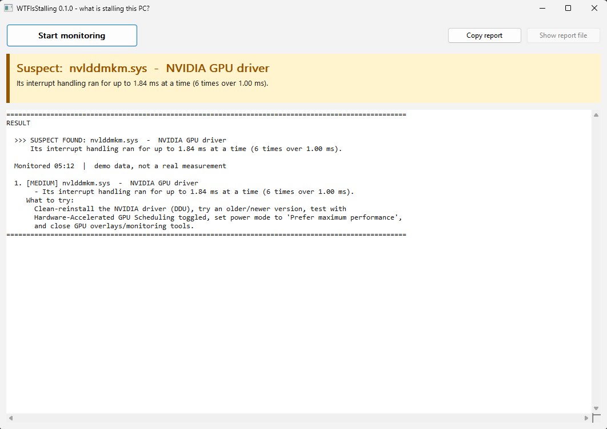

# WTFIsStalling

[](https://github.com/Tyberious/WTFIsStalling/actions/workflows/ci.yml)
[](https://github.com/Tyberious/WTFIsStalling/releases/latest)
[](https://github.com/Tyberious/WTFIsStalling/releases)
[](LICENSE)


[](https://github.com/Tyberious/WTFIsStalling/issues)
[](CONTRIBUTING.md)
[](https://github.com/Tyberious/WTFIsStalling/stargazers)

**Finds the driver, program or hardware behind hitches, micro-stalls and audio crackle on Windows.**

Someone tells you "my PC stutters every few seconds" and nothing in Task Manager explains it.
WTFIsStalling watches the Windows kernel while the problem happens and then tells you, in plain
language, what was responsible and what to try.

It is a single small `.exe`. No installer, no driver, no dependencies. It only observes; it changes
nothing on the system.

## Use it

1. Download `WTFIsStalling.exe` from [Releases](https://github.com/Tyberious/WTFIsStalling/releases) and run it.
   Say **Yes** to the administrator prompt (tracing the kernel requires it).
2. Click **Start monitoring**.
3. Use the PC until the hitch happens, ideally a few times. Run the game or app that has the problem.
4. Click **Stop**. Read the summary, or click **Copy report** and paste it to whoever is helping you.

> **"Windows protected your PC"?** That is SmartScreen reacting to a new, unsigned program that few
> people have downloaded yet, not a virus detection. Click **More info**, then **Run anyway**. If you
> would rather verify first, compare the file against `SHA256SUMS.txt` from the same release
> (`Get-FileHash WTFIsStalling.exe` in PowerShell), or build it yourself from this source.

The colored bar gives the verdict; the report underneath starts with the ranked findings and what to
try for each, followed by the supporting numbers and the event log. A copy is saved next to the exe as
`WTFIsStalling-<date>.txt`. The window follows the system light / dark theme.

| | |
| --- | --- |
|  |  |

*(Screenshots show built-in demo data.)*

## What it can pin down

| Cause | How it shows up |
| --- | --- |
| A misbehaving **driver** (GPU, network, Wi-Fi, USB, audio, storage, RGB/monitoring tools...) | Long DPC/ISR routines, attributed to the exact `.sys` file, with advice for the usual suspects |
| **Firmware / BIOS / SMI**, hypervisor, or a driver running with interrupts off | The CPU "goes dark": a stall with no OS-visible activity and missing profiler interrupts |
| A **program** starving the CPU | A normal-priority thread can't get a core; the report names who was on the CPUs |
| **Paging** (not enough RAM, or a process being swapped in) | Hard page faults per process with how long each was frozen |
| A **slow or dying disk** | Per-disk request latency, slow requests and who issued them |

What it cannot see: stalls inside an application itself or on the GPU (shader compilation, VRAM
overflow, frame pacing). If a hitch happened and the report is clean, that's where to look next.

## Example report (illustrative)

```
====================================================================================================
RESULT

  >>> PROBLEM FOUND: rtwlane.sys  -  Wi-Fi adapter driver
      Blamed for 14 stalls (worst 11.80 ms, 121 ms in total).  (+1 more finding below)

  Monitored 05:12  |  14 kernel-level stall(s), 0 CPU-starvation stall(s)  |  worst wake-up delay 11.80 ms ...

  1. [HIGH] rtwlane.sys  -  Wi-Fi adapter driver
       - Blamed for 14 stalls (worst 11.80 ms, 121 ms in total).
       - Its interrupt handling ran for up to 10.97 ms at a time (14 times over 1.00 ms). Healthy
         drivers stay under 0.5 ms; longer runs block everything else on that CPU core ...
     What to try:
       Update the Wi-Fi driver from the chip vendor (Intel/Realtek/MediaTek/Qualcomm), disable adapter
       power saving and background scanning/roaming aggressiveness; test with Wi-Fi off and Ethernet in.

  2. [MEDIUM] Disk 1  -  responding slowly
       - 3 requests took longer than 200 ms (worst 840 ms).
     What to try: ...
====================================================================================================
DETAILS
  (who caused the stalls, per-driver DPC/ISR table, hard page faults per process, disk latency)

EVENT LOG (chronological)
[21:14:07.412] STALL #3  kernel-level (DPC/ISR/firmware)  11.80 ms  on CPU 4
    VERDICT: rtwlane.sys [Wi-Fi adapter driver] kept the CPU in DPC/ISR code for 93% of the stall
    ...
```

Findings come from stalls (who was blamed), drivers whose DPC/ISR routines run too long even without a
full stall, programs frozen by paging, and disks answering slowly. **HIGH** means it repeatedly or
badly stalled the machine, **MEDIUM** is a suspect that can cause crackle and micro-stutter.

## How it works

Two independent sources, correlated on one clock (QPC):

* **Kernel ETW trace.** A private real-time system-logger session records every DPC and ISR (with the
  driver routine address and duration), hard page faults, disk I/O latency, thread creation (for
  thread → process mapping) and 1 kHz CPU profile samples. Routine addresses are resolved to the loaded
  driver; a built-in knowledge base plus each file's version resource explains what that driver is.
* **Latency probes.** A helper process in the REALTIME priority class runs one thread per CPU at
  priority 31, pinned, waking every millisecond and measuring how late each wake-up was. Nothing but
  DPCs, ISRs, code at raised IRQL, firmware (SMI) or a hypervisor can delay those threads, so a late
  wake-up *is* a kernel-level stall. A second, normal-priority probe detects plain CPU starvation.

When a probe reports a stall, the analyzer waits for the trace to catch up, looks at exactly what ran
on that CPU during that window and issues a verdict:

1. DPC/ISR time covers the stall → blame the driver that owns the routine.
2. Almost no profiler interrupts arrived and no DPC/ISR explains it → the CPU was taken away from
   Windows entirely: SMI/firmware, hypervisor, or interrupts disabled.
3. Otherwise → whichever kernel module or process the CPU samples show.

Individually slow events (DPC ≥ 1 ms, hard fault ≥ 50 ms, disk request ≥ 200 ms) are logged even when no
probe stalls.

## Command line

`wtfis-cli.exe` is the same engine on the console, for scripting and for tuning thresholds:

```
wtfis-cli --duration 300 --stall-ms 2 --dpc-warn-us 500
```

Run `wtfis-cli --help` for all options. Press Ctrl+C to stop and print the summary.

## Building

Requires Rust (stable) on Windows, either toolchain (`x86_64-pc-windows-msvc` or `-gnu`).

```
cargo build --release
```

produces `target/release/WTFIsStalling.exe` (GUI) and `target/release/wtfis-cli.exe`. Both are
statically linked and need nothing but Windows 10 1803 or later, 64-bit.

```
cargo test
cargo clippy --all-targets -- -D warnings
cargo fmt --check
```

RustRover / IntelliJ users get ready-made run targets from the `.run/` folder: the GUI (normal,
elevated-and-debuggable, or UI-only), 30-second CLI captures, and the same test / clippy / fmt checks
CI runs.

Working on the window without admin rights:

| Variable | Effect |
| --- | --- |
| `WTFIS_DEMO=problem\|warning\|ok` | Start/Stop shows a canned result instead of monitoring |
| `WTFIS_THEME=dark\|light` | Override the system theme |
| `WTFIS_SKIP_ELEVATION=1` | Don't elevate; real monitoring then fails with "access denied" (tests that path) |

## Contributing

Yes please. The most valuable contributions need no kernel knowledge at all: **teach the tool about
more drivers** (see `KB` in [`src/modules.rs`](src/modules.rs)) and **send reports from real problem
machines**. See [CONTRIBUTING.md](CONTRIBUTING.md).

## License

[MIT](LICENSE)
